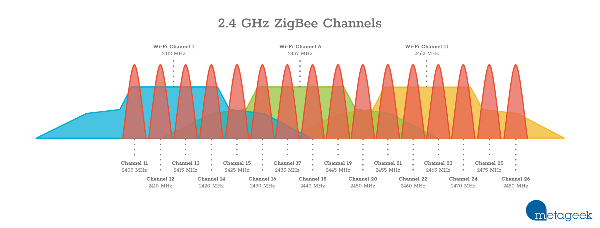

# NirSoftWifiInfoView
Contains the python script I use to view which is the best channel to put my zigbee on.

## NirSoftWifiInfoView.py:
### Issues:
- Living in a medium/high human density environment leads us to a medium/high wifi AP density.
- When implementing a Zigbee network for our home, we must choose a channel that it's not noisy.
- I want to see it in a graphical way.



### Solution:
- Use Nirsfot wifi info software to capture the signals aroud you.
- Process it using NirSoftWifiInfoView.py
- Enjoy taking the right channel choice decision.

### Nirsoft:
Download the software from:

https://www.nirsoft.net/utils/wifi_information_view.html

Execute it and keep it capturing wifi traffic for a while.
Now we are going to save all the captured data, got to "File" -> "Save All Items" -> "Save as type" -> "Comma Delimited text File (*.csv)" -> WriteDownSomeNiceName.csv

### Python:
Create some venv, don't we dirty and keep your computer clean, not like your room ... I can smell it even from github.
```sh
python -m venv venv
.\venv\Scripts\Activate.ps1 {If running on PowerShell}
venv\Scripts\activate.bat {If running on cmd}
./venv/Scripts/activate {If running on linux}
```

Install the requirements for this script:

```sh
pip install -r requirements.txt
```

Adjust a very minimal config in the script, set "FileName" to the filename you saved in nirsoft (WriteDownSomeNiceName.csv)

> FileName='Scan-Dorm1.csv'

Run the script:

> python NirSoftWifiInfoView.py

### The output

Figure1 will show you the distribution of the detected wifis, and the zigbee channels.


Figure2 will show you the addition of the power of all the wifis together, and the zigbee channels.


In this example it's really easy to fins that channel 15 and 20 are the best option as the power of the surounding wifis in that point is the smallest.

### Deep inside script config:

Let me explain some basic parameters of the script, so you can play around a little bit

> FileName='Scan-Dorm1.csv'
> 
> Tabulate=False
> 
> JustLowerThan=36
> 
> ZigBeeWidth=2
> 
> ZigBeeDown=0.1
> 
> ZigBeeOverWifi=1
> 
> WiFiWith=20
> 
> WiFiDown=1

* Filename: Name of the csv file for wifiinfo.
* Tabulate: If set to true script will show you step by step how the data is build.
* JustLowerThan: Maximun channel to process, channels above 36 are really out of scope, because zigbee is not working in that frequencies.
* ZigBeeWidth: The stimated witdh of the zigbee signal, according to wikipedia it should be arroun 2MHz
* ZigBeeDown: It will take 0.1 MHz for a zigbee signal to desappear, square frequency signals are not reallistic
* ZigBeeOverWifi: In order to see the graphical more clear, you can draw the zigbee channels taller
* WiFiWith=20: The stimated witdh of the wifi signal, according to wikipedia it should be arroun 20MHz
* WiFiDown=1: It will take 1 MHz for a wifi signal to desappear, square frequency signals are not reallistic
